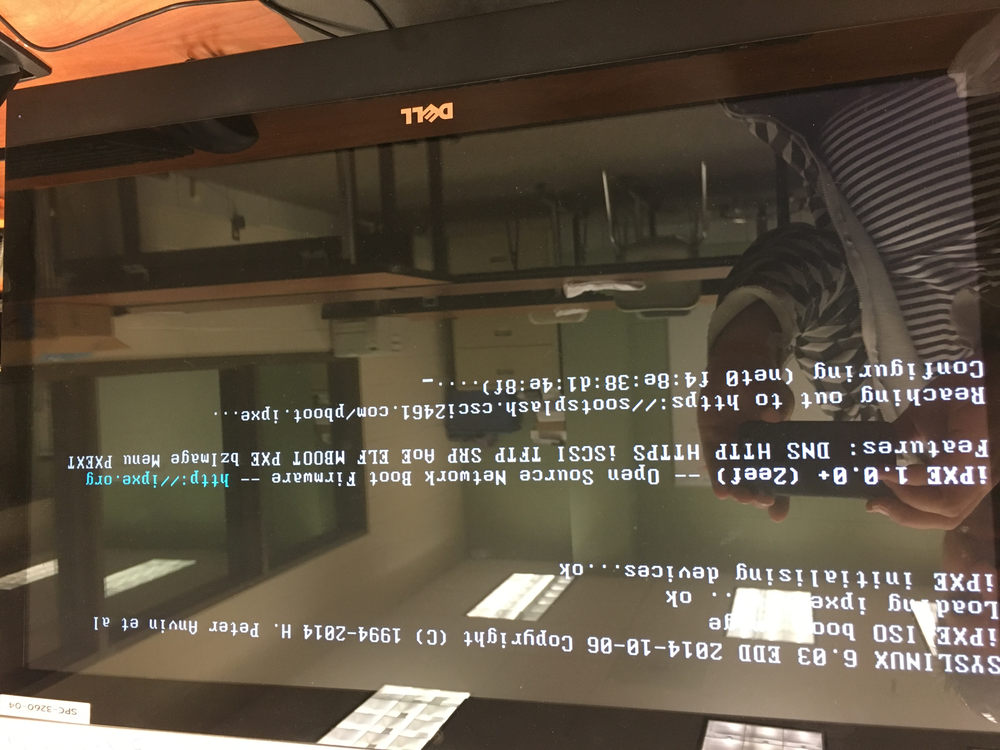
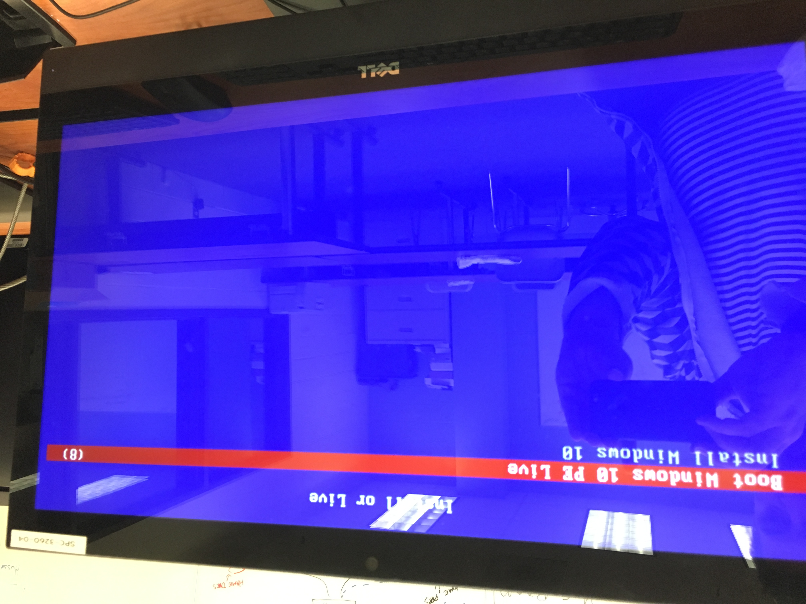
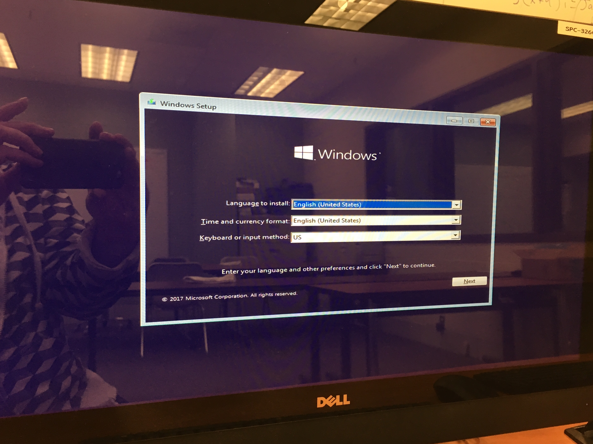
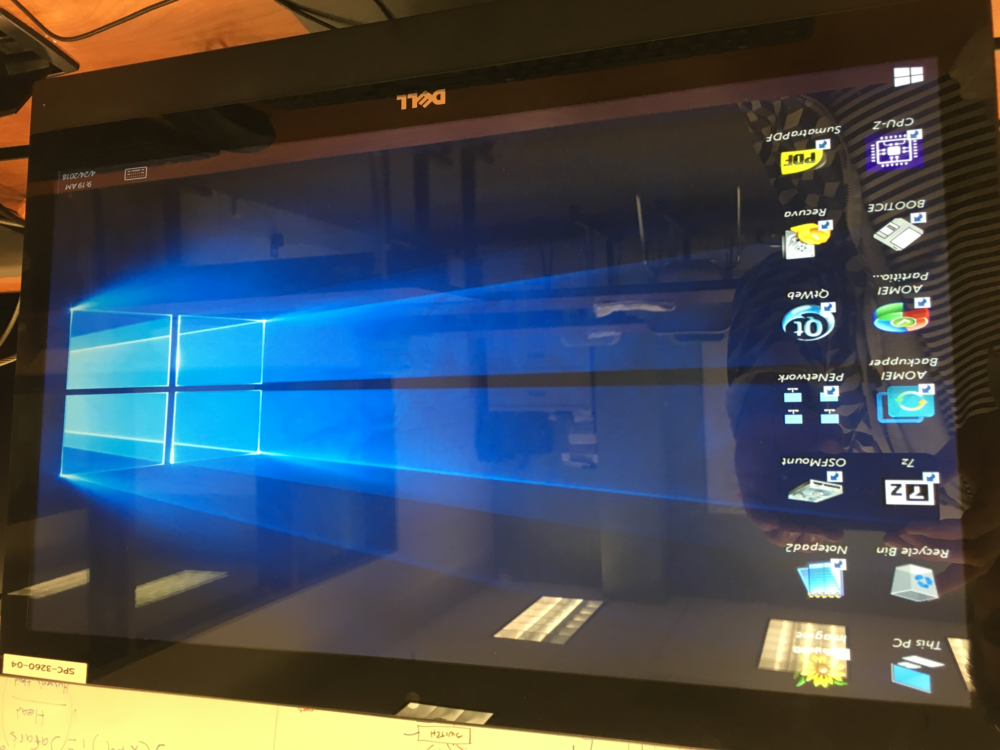
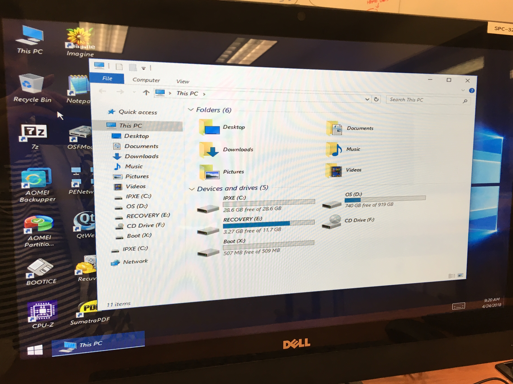

# Oops/Sl@ckers
## Week 15, iPXE and Windows Live/Install Deployed.
### Pavel Danek

Hello everyone, another week went by I got some significant progress with my part of the project. The [iPXE](https://ipxe.org/start) along with the embedded [pavelboot](Scripts/pavelboot) script has been deployed and has been tested in case of successful and unsuccessful connection.
The [pboot.ipxe](Scripts/pboot.ipxe) script on our remote server has changed a little and a custom menu has been added (see pictures below). Now we're able to either perform a **full install of Windows 10** or deploy **Windows 10 PE** (aka live version of Windows) in order to access/repair problems on the host PC.

_How is it all done?_

**Step 1.**
Obtain Windows 10 Installation ISO file. That can be done [here](https://www.microsoft.com/en-us/software-download/windows10ISO).

**Step 2.**
Obtain Windows 10 PE (Preinstallation Environment) ISO file. For this I found a third-party software called [AOMEI PE Builder](https://www.aomeitech.com/pe-builder.html). Works well and fast. It will take you through the process.

**Step 3.**
Update the pboot.ipxe (see above) on the server.

**Step 4.**
Burn both ISO files onto media, in order to get the individual directory tree with files. Each set of these has to be uploaded to our server. It's done in Linux's Terminal, like so: `rsync -rv /<your Win10 directory>/* <username>@<name of your server>.csci2461.com:~/Win10`.
Later, after logging in, move the folder into the proper place on server (in our case `/var/www/html/`).

**Step 5.**
Add iPXE's [wimboot](https://github.com/ipxe/wimboot/blob/master/wimboot) (Windows WIM file boot manager) into _EACH_ bootable version's **base** directory. This is _very_ important; without _wimboot_ your Windows won't start!!

That's it!

This is, what the result looks like:

Booting with iPXE:

Decision menu: Install or Live (programmed with iPXE tools):

The screen that appears after choosing **INSTALL**:

If you choose **LIVE** however, the AOMEI Desktop shows up:

Thanks to the LIVE Desktop, you're able to salvage the files on a local HDD and/or do other repair jobs:

That's it for today! Thank you very much for taking the time to read this guy's typos...! :-D

-Pavel.
